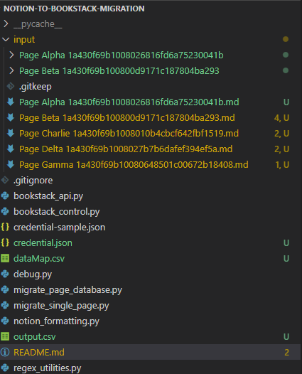

# Notion Markdown to Bookstack Importer

<!-- TABLE OF CONTENTS -->

**Table of Content**

- [Notion Markdown to Bookstack Importer](#notion-markdown-to-bookstack-importer)
  - [Overview](#overview)
  - [Dependency](#dependency)
  - [Usage](#usage)
  - [Contributing](#contributing)
  - [License](#license)
  - [Contact](#contact)

<!-- ABOUT THE PROJECT -->

## Overview

This script is used to migrate markdown page and it's image attachment to bookstack through bookstack api

Features:

- import non-nested database of page
- attachment (image, and files) uploading support

## Dependency

| Package Name | Version |
| ------------ | ------- |
| pandas       | -       |
| requests     | -       |

<!-- USAGE EXAMPLES -->

## Usage

1. install required dependency using pip `pip install pandas requests`
2. create `credential.json` by following `credential-sample.json`
   - create token in bookstack user settings
3. put the notion pages markdown and it's attachment folder in input folder
   
4. put page database `.csv` to root dir, and rename it to `dataMap.csv`
5. modify content of `migrate_page_database.py`, and/or `migrate_single_page.py` configuration line to conform your needs

<!-- CONTRIBUTING -->

## Contributing

Contributions are what make the open source community such an amazing place to learn, inspire, and create. Any contributions you make are **greatly appreciated**.

If you have a suggestion that would make this better, please fork the repo and create a pull request. You can also simply open an issue with the tag "enhancement".
Don't forget to give the project a star! Thanks again!

1. Fork the Project
2. Create your Feature Branch (`git checkout -b feature/AmazingFeature`)
3. Commit your Changes (`git commit -m 'Add some AmazingFeature'`)
4. Push to the Branch (`git push origin feature/AmazingFeature`)
5. Open a Pull Request

<!-- LICENSE -->

## License

Distributed under the MIT License.

<!-- CONTACT -->

## Contact

<asembus@gmail.com>

Project Link: <https://github.com/github_username/repo_name>
